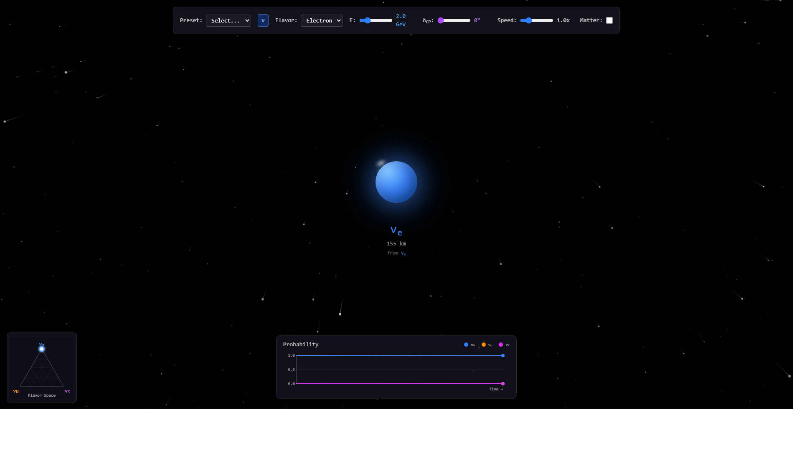

# Imagining the Neutrino

[](LICENSE)
[](https://github.com/planckeon/itn/actions/workflows/deploy.yml)
[](https://github.com/planckeon/itn)

**[▶ Launch Demo](https://planckeon.github.io/itn/)**



An interactive visualization of 3-flavor neutrino oscillations. Watch a neutrino fly through space as its flavor changes, with real-time probability calculations.

Built with React + TypeScript + Zig WASM. A [Planckeon Labs](https://github.com/planckeon) project.

## Features

### Visualization
- **Immersive 3D Starfield** — Fly through space with the neutrino
- **Interactive Camera** — Drag to rotate your view (mouse or touch)
- **Color-Evolving Sphere** — The neutrino's color reflects its flavor probabilities
- **MSW Resonance Glow** — Golden ring when at matter resonance energy

### Analysis Plots
- **Probability vs Distance** — P(νₑ), P(νμ), P(ντ) over time with oscillation length markers
- **Ternary Flavor Triangle** — VISOS-style flavor space trajectory
- **Energy Spectrum** — P vs E at current distance (bottom right)
- **PMNS Matrix** — |U|² mixing matrix display (top right)

### Physics Controls
- **Experiment Presets** — 11 experiments: T2K, NOvA, DUNE, Hyper-K, KamLAND, Daya Bay, JUNO, Double Chooz, Super-K, IceCube, Solar
- **δCP Slider** — CP violation phase (0-360°)
- **ν/ν̄ Toggle** — Neutrino/antineutrino mode
- **NO/IO Toggle** — Normal/Inverted mass ordering
- **Matter Effect** — Enable MSW effect with adjustable density
- **Energy & Speed** — Continuous sliders

### Educational
- **Learn More Panel** — 8 sections covering neutrino physics with LaTeX formulas
- **Settings Panel** — Language selection, density presets
- **3D PMNS Matrix** — Interactive rotatable visualization
- **KaTeX Math Rendering** — Beautiful LaTeX equations
- **Internationalization** — EN, ES, JA, ZH, HI, FR, DE

### Quality of Life
- **Keyboard Shortcuts** — See below (press `?` for help)
- **Help Modal** — Press `?` for shortcuts reference
- **URL Sharing** — Share exact configurations via URL
- **Info Tooltips** — Hover over (?) for physics explanations
- **Mobile Responsive** — Full touch support with compact UI

## URL Sharing

Share your exact simulation configuration via URL hash:

```
https://planckeon.github.io/itn/#e=2.5&f=muon&d=180&m=1&o=inverted
```

Parameters:
- `e` — Energy (GeV)
- `f` — Initial flavor (electron|muon|tau)
- `d` — δCP (0-360)
- `a` — Antineutrino mode (1 = on)
- `m` — Matter effect (1 = on)
- `o` — Mass ordering (normal|inverted)
- `p` — Preset name (t2k|nova|dune|kamland)

## Keyboard Shortcuts

| Key | Action |
|-----|--------|
| `Space` | Play/Pause |
| `A` | Toggle antineutrino |
| `M` | Toggle matter effect |
| `N` | Toggle mass ordering |
| `R` | Reset simulation |
| `1-4` | Apply presets (T2K, NOvA, DUNE, KamLAND) |
| `↑/↓` | Adjust energy |
| `←/→` | Adjust δCP |
| `S` | Copy share URL |
| `?` | Show help modal |

## Physics

Powered by [**nufast**](https://github.com/planckeon/nufast) compiled to WebAssembly—the same algorithm used by T2K and JUNO, running at **20 million calculations per second** in your browser.

The WASM binary is **13 KB**. No CDN physics libraries, just math.

Based on the **NuFast** algorithm ([arXiv:2405.02400](https://arxiv.org/abs/2405.02400)) by P.B. Denton.

**Parameters (NuFit 5.2):**
- θ₁₂ = 33.44°, θ₁₃ = 8.57°, θ₂₃ = 49.2°
- Δm²₂₁ = 7.42×10⁻⁵ eV²
- Δm²₃₁ = +2.517×10⁻³ eV² (NO) / −2.498×10⁻³ eV² (IO)

## Tech Stack

| Layer | Tech |
|-------|------|
| Framework | React 19 + TypeScript |
| Build | Vite |
| Styling | Tailwind CSS |
| Rendering | Canvas 2D (60fps) |
| Physics | nufast WASM (Zig → WASM, 13 KB) |
| Math | KaTeX |
| State | React Context |
| Testing | Vitest (166 tests) |

## Development

```bash
npm install      # Install dependencies
npm run dev      # Dev server at localhost:5173
npm run build    # Production build
npm test         # Run tests (166 passing)
```

## Project Structure

```
src/
├── components/
│   ├── Starfield.tsx          # 3D starfield with camera rotation
│   ├── NeutrinoSphere.tsx     # Color-blending sphere + MSW glow
│   ├── ProbabilityPlot.tsx    # P vs L plot with markers
│   ├── TernaryPlot.tsx        # Flavor triangle
│   ├── EnergySpectrumPlot.tsx # P vs E spectrum
│   ├── PMNSMatrix.tsx         # |U|² mixing matrix
│   ├── PMNSMatrix3D.tsx       # Interactive 3D PMNS view
│   ├── LearnMorePanel.tsx     # Educational content
│   ├── SettingsPanel.tsx      # Language & advanced options
│   ├── TopControlBar.tsx      # All controls
│   ├── InfoTooltip.tsx        # Physics explanations
│   └── HelpModal.tsx          # Keyboard shortcuts modal
├── hooks/
│   ├── useKeyboardShortcuts.ts
│   └── useURLState.ts         # URL state sharing
├── i18n/
│   ├── translations.ts        # All language strings
│   └── I18nContext.tsx        # Language provider
├── context/
│   └── SimulationContext.tsx  # All state + physics
├── physics/
│   ├── nufast.js              # Zig WASM loader
│   ├── nufast.wasm            # Physics engine (13 KB)
│   ├── wasmBridge.ts          # WASM interface
│   ├── prem.ts                # PREM Earth model
│   └── types.ts               # Interfaces
└── utils/                     # Helpers
```

## Citation

If you use Imagining the Neutrino in your research or teaching, please cite:

```bibtex
@software{itn,
  author = {Kataru, Baalateja},
  title = {Imagining the Neutrino: Interactive 3-Flavor Oscillation Visualization},
  year = {2026},
  publisher = {GitHub},
  url = {https://github.com/planckeon/itn}
}
```

The physics engine is based on:

```bibtex
@article{Denton:2024xzk,
  author = {Denton, Peter B. and Parke, Stephen J.},
  title = "{NuFast: Fast and Accurate Neutrino Oscillation Probabilities}",
  eprint = "2405.02400",
  archivePrefix = "arXiv",
  primaryClass = "hep-ph",
  year = "2024"
}
```

## License

MIT — see [LICENSE](LICENSE)

## Changelog

See [CHANGELOG.md](CHANGELOG.md) for release history.
